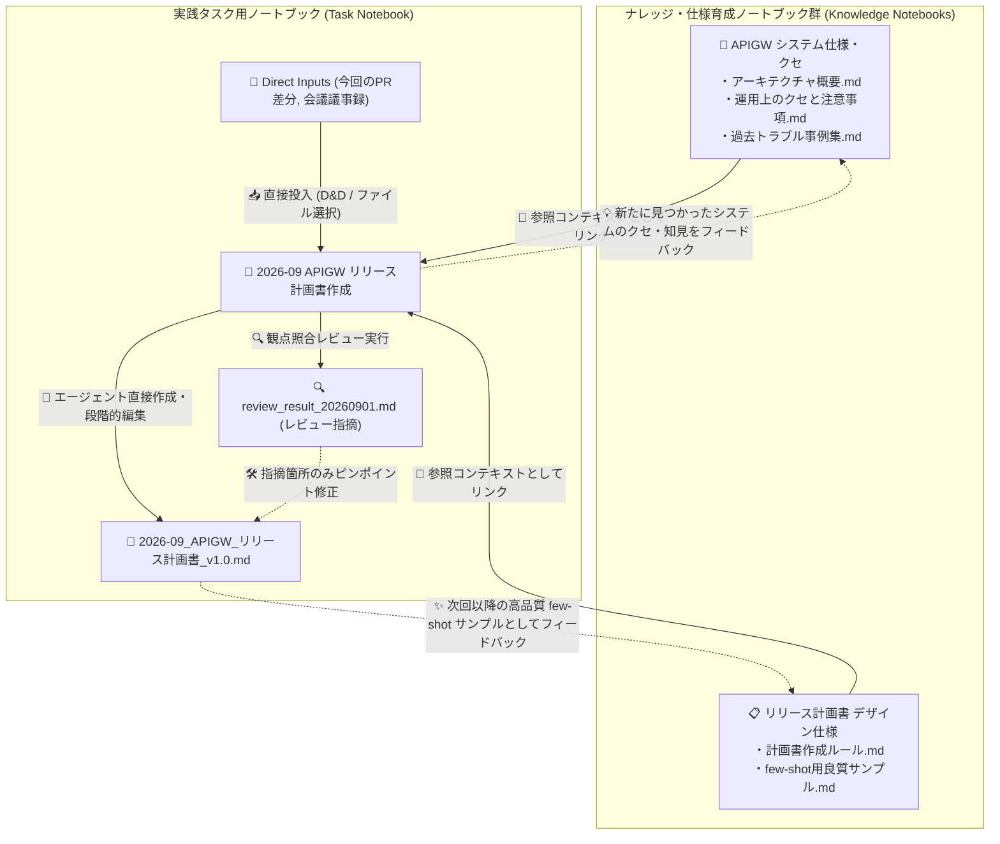

# Obsidian AI Notebook - 設計コンセプト & アーキテクチャ思想
## ナレッジ再帰育成型エコシステム (Recursive Knowledge Ecosystem)

---

## 1. 背景と課題意識 (Problem Statement)

### 従来の AI ノートツール（NotebookLM / チャットセッション）の限界
- **単一セッション完結による知見の散逸**:
  Web上の NotebookLM や Gemini、ChatGPT などの対話ツールでは、資料をアップロードして分析やドラフト生成を行っても、そのセッションで作成された成果物や得られた知見がその場で閉じてしまい、次の新しいタスク・別プロジェクトへ有機的に引き継がれません。
- **ドメイン知識・フォーマットの硬直化**:
  「このシステムのクセ・過去トラブル」「この会社・チームのリリース計画書フォーマット」といったルールやベストプラクティスが固定的な設定やプロンプトとして分離され、日々の作業を通じて育っていかないという課題がありました。

---

## 2. コアコンセプト: Antigravity 2.0 / プロジェクトフォルダ型ナレッジ管理

本プラグインにおける **「Notebook」** は、単なる使い捨ての対話メモや静的レポートではなく、**Antigravity 2.0 や Claude Code がプロジェクトフォルダ（Gitリポジトリ）上でコード群を育てていくのと同等な「自律的・再帰的ナレッジ空間」** として定義されます。



### コア原則 (Core Principles)

1. **すべての Notebook は対等なナレッジワークスペースである (Symmetric Workspaces)**:
   - 「タスク実行用」「システム知識」「テンプレート」という固定的なクラス分けを行いません。
   - すべての Notebook が自身のインプット（`sources/`）、対話（`sessions/`）、そして洗練された成果物（`artifacts/`）を持ちます。
2. **成果物が次のタスクのソース（コンテキスト）になる (Recursive Context)**:
   - ある Notebook で生成・洗練された成果物（例: 過去のリリース計画書、システム注意点メモ）は、別の新しいタスク Notebook の「参照ソース」としてそのままマウントできます。
3. **物理コピーではなく参照リンク (Linked Context Model)**:
   - ファイルを毎回複製するのではなく、Vault 内の Notebook やフォルダを「参照リンク」として紐付けます。
   - 参照元の知識ノートが更新（AIと対話して追記・修正）されると、その知識を参照しているすべての後続タスクに常に最新のコンテキストが反映されます。
4. **エージェント直接編集モデル (Direct Agent File Editing)**:
   - AI を単なる補完APIとして扱うのではなく、ノートブックルートを作業ディレクトリ（`cwd`）としてエージェントに渡し、成果物（`artifacts/`）を直接作成・部分編集（Write/Edit）させます。
   - 章を1つずつ書き足す段階的作成や、手作業修正の維持、指摘箇所のみの部分修正が可能です。
5. **レビュー成果物とフィードバックループ (Review as Artifacts)**:
   - リンクされた仕様や作成ルールに照らしてレビューを実行し、指摘結果を独立した成果物（`artifacts/review_*.md`）として出力・管理します。
6. **イベントログによる生成来歴の記録 (Event-driven Provenance)**:
   - 成果物 md 自体に frontmatter を足さず、対話メッセージのイベントログ（`ChatMessage.artifactsGenerated`, `linkedNotebookIds`）として来歴を記録します。
7. **エージェントの振る舞いは設計しない (Thin Wrapper Principle)**:
   - 本プラグインは CLI エージェントの判断・対話フローに介入しません。箱（ノートブックフォルダ）を用意し、文脈を `CLAUDE.md` として書き出し、素の CLI を起動するだけです。
   - 「必ずこう振る舞え」というプロンプト注入は行いません。振る舞いの切り替えが必要なら、CLI 本来のオプション（`--permission-mode` など）で表現します。
   - 判断基準: **その処理はターミナルから素の `claude` を叩いたときにも成立するか？** 成立しないなら、それはラッパーの過剰介入です。

---

## 3. 具体的なユースケース・運用フロー

### ユースケース 1: 仕様・ドメイン知識ノートを育てる
1. **「APIGW システム仕様・クセ」** というノートブックを作成。
2. 仕様書や過去のSlackログ等を `sources/` に投入し、AIと対話して成果物 `運用上のクセと注意事項.md` や `過去トラブル事例集.md` を生成・ブラッシュアップ。
3. 今後新たなインシデントや仕様変更が発生したら、この Notebook を開いてAIに対話・追記させ、成果物を育てていく。

### ユースケース 2: フォーマット・デザイン仕様ノートを育てる
1. **「リリース計画書 デザイン仕様」** というノートブックを作成。
2. 計画書の作成ガイドラインや、過去の「最も出来の良かった計画書」を成果物（few-shot サンプル）として配置。

### ユースケース 3: 実践タスクで段階的作成 & レビューサイクルを回す
1. **「2026-09 APIGW リリース計画書作成」** ノートブックを作成。
2. ソースパネルから、**「APIGW システム仕様」** と **「リリース計画書 デザイン仕様」** を参照リンクとして追加。
3. 今回のPR差分（`diff.patch`）や会議メモを直ファイルとしてドロップ。
4. 「第1章と第2章のドラフトを作って」と指示し、段階的に成果物を構築。手作業で調整した箇所も保持。
5. 「🔍 レビュー実行」により、デザイン仕様やシステム注意事項に照らした点検結果（`review_result_*.md`）を出力。
6. 指摘内容を確認し、「指摘事項の2点目を計画書に反映して」と指示してピンポイント修正。
7. 完成した計画書は、次回以降の「良質サンプル」として活用される。

---


## 3.5 エージェント実行モデル (Agent Execution Model)

### なぜ「薄いラッパー」なのか

Claude Code や Antigravity CLI は、それ自体が計画・探索・段階的編集・自己修正を行う成熟したエージェントです。ここに独自のプロンプトや強制ルールを重ねると、CLI 本体の改善がそのまま享受できなくなるうえ、両者の指示が競合して品質が落ちます。

実際、初期実装では「必ず成果物ファイルを作れ」「質問だけ返すな」といった行動規範を注入していましたが、次の実害が出ました。

- 指示 → 計画提示 → ユーザーレビュー → 実装 という、本来もっとも健全な進め方が禁止されてしまった
- 対話履歴をテキストで再注入していたため、モデルが前ターンの自分の失敗表現を模倣し続け、同じ失敗が自己強化された
- 成果物ゼロを失敗とみなす自動リトライにより、実行時間が倍になった

これらはすべて撤去し、CLI ネイティブの機能に置き換えています。詳細と再発防止の観点は `design-doc.md` の第4章を参照してください。

### 相談モードと作成モード

チャット入力欄のトグルで、2つの実行モードを切り替えます。これは `--permission-mode` への単純なマッピングです。

- **相談（既定）**: 読み取りのみ。ソースと参照コンテキストを読んだ上で、成果物案・章立て・論点をチャットに返す
- **作成**: `artifacts/` に成果物を作成・編集する

既定を「相談」にすることで、いきなり書き始めるのではなく、まず計画をレビューする流れが自然な既定になります。

読み取り専用は「権限モード」ではなく「渡すツール」で表現します（`--disallowedTools`）。`--permission-mode plan` は人間の承認を前提とする対話モードで、非対話実行では停止するためです。承認プロンプトが発生しうる経路は、常に `bypassPermissions` で潰しておきます。

### 会話は CLI 側のセッションで継続する

チャットセッションごとに UUID を採番し、初回 `--session-id`、以降 `--resume` で CLI 側の会話を引き継ぎます。プラグインが履歴をプロンプトに詰め直すことはありません。`sessions/*.json` は UI 表示用の記録に徹します。

---

## 4. データ構造 (Data Architecture)

```
<Vault_Root>/
└── _ainotebook/
    ├── index/
    │   ├── <notebook_id>.md      # ノートブックメタデータ (Frontmatter)
    │   └── ...
    └── notebooks/
        └── <notebook_id>/
            ├── sources/          # 今回の直接投入ファイル (D&D等)
            ├── artifacts/        # このノートブックで生成・育成された成果物群
            ├── sessions/         # チャットセッション群 (マルチスレッド)
            │   ├── session_xxx.json
            │   └── session_yyy.json
            └── chat.json         # （旧形式互換用）
```

### メタデータ定義 (`index/<notebook_id>.md`)
```yaml
---
notebook_id: "20260831_x9f2a"
title: "2026-09 APIGW リリース計画書作成"
created_at: "2026-08-31T17:00:00+09:00"
updated_at: "2026-08-31T17:00:00+09:00"
tags: [release, apigw, task]
icon: "rocket"
description: "2026年9月度 APIGW 本番リリース計画書の作成"
linked_notebook_ids:
  - "20260831_sys_apigw"       # 📘 APIGW システム仕様・クセ
  - "20260831_tpl_release_plan"# 📋 リリース計画書 デザイン仕様
active_session_id: "session_20260831_abc"
---
```

---

## 5. UI/UX デザイン方針

```
+-----------------------------------------------------------------------------------+
| < ギャラリー | 🚀 2026-09 APIGW リリース計画書作成                   [Antigravity CLI] |
+-------------------+-----------------------------------+---------------------------+
| [コンテキスト・ソース] | [💬 AI チャット] [💬ドラフト作成 ▼][+新規] | [成果物 (Artifacts)]      |
|                   |                                   |                           |
| 🔗 参照ノートブック    | User: 今回のPR差分から計画書を    | 📄 2026-09_APIGW_計画書.md |
|  ├ 📘 APIGW 仕様 [×] |       作って。                    |                           |
|  └ 📋 リリース仕様 [×]| AI  : APIGWのコネクションドレイン | (クリックで編集・プレビュー)|
|   [+ 参照ノート追加]   |       待ち時間と、サンプルの章立て|                           |
|                   |       を踏まえて作成しました。    |                           |
| 📂 直接ファイル (Inputs)|     ```markdown:...            |                           |
|  ├ pr_diff.patch  |                                   |                           |
|  └ memo.txt       |                                   |                           |
|   [+ ファイル追加] | [ メッセージを入力...     (送信) ]|                           |
+-------------------+-----------------------------------+---------------------------+
```

- **ヘッダー**:
  - 不要な固定プルダウンを排除し、シンプルで集中できるヘッダーに刷新。
- **左カラム（ソースパネル）**:
  - **「🔗 参照ノートブック (Linked Notebooks)」**: Vault内の既存ノートブックをモーダルから複数選択してリンク。リンク解除（×）や該当ノートへの直接ジャンプが可能。
  - **「📂 直接ファイル (Direct Inputs)」**: ファイルD&Dおよびファイル選択。
- **中央カラム（チャットパネル）**:
  - **マルチチャットセッション対応**: セッション切り替えドロップダウン、新規セッション作成（+）、リネーム・削除機能を統合。
  - リンクされたノートブックの成果物（仕様、フォーマット、few-shot）と直接ファイル、そして直近の対話履歴を自動集約してプロンプトを構築。
- **右カラム（成果物パネル）**:
  - 生成されたMarkdown成果物を一覧表示・モーダル編集。

