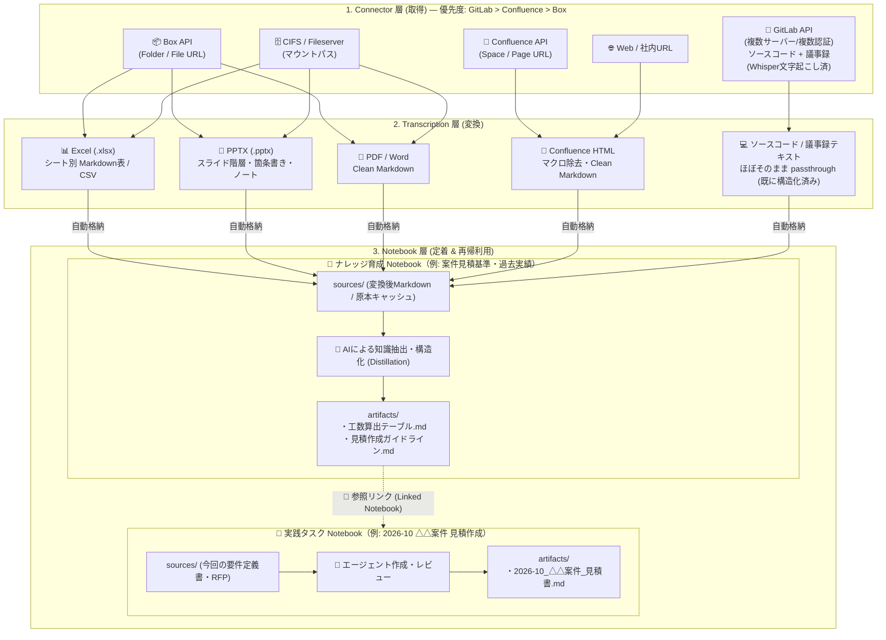
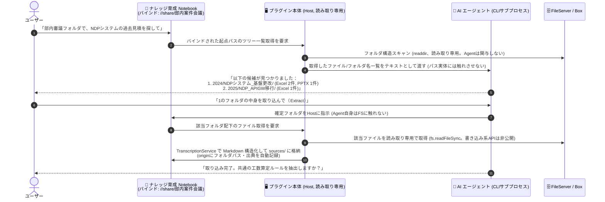

# Design Document: Obsidian AI Notebook Plugin
## ナレッジ再帰育成型アーキテクチャ (Recursive Knowledge Ecosystem)

## 1. 概要 (Overview)
`Obsidian AI Notebook` は、Google NotebookLM の直感的なコンテキスト駆動型ワークスペース体験と、Antigravity 2.0 / Claude Code のプロジェクトフォルダ型ファイル育成モデルを融合させた Obsidian プラグインです。
ユーザーは「ノートブック」という単位で特定のテーマ・プロジェクトに関するインプット（直ファイル・参照ノート）を集約し、ローカルAIエージェント（Antigravity CLI / Claude Code CLI）と対話しながら、成果物を生成・管理します。
さらに、生成された成果物は他の新しいタスクのコンテキスト（仕様・ルール・few-shot サンプル）としてシームレスに再利用・育成されます。

詳細な思想的背景については [concept.md](concept.md) を参照してください。

---

## 2. コア概念 & データ構造 (Core Architecture & Data Structure)

### 2.1 データフォルダ構造
全ノートブックデータは Obsidian Vault 内の専用ルートフォルダ（デフォルト: `_ainotebook/`）配下で一元管理されます。

```
<Vault_Root>/
└── _ainotebook/
    ├── index/
    │   ├── 20260831_sys_apigw.md       # APIGW 仕様ノートのメタデータ
    │   ├── 20260831_tpl_release.md     # リリース計画書仕様ノートのメタデータ
    │   └── 20260831_task_rel09.md      # 9月度リリース計画書タスクのメタデータ
    └── notebooks/
        ├── 20260831_sys_apigw/         # システム知識・クセ育成ノート
        │   ├── sources/                # 投入された元資料・設定メモ等
        │   ├── artifacts/              # 成果物: アーキ概要.md, 運用注意点.md
        │   ├── sessions/               # チャットセッション群
        │   │   └── session_01.json
        │   └── chat.json               # （旧形式互換）
        ├── 20260831_tpl_release/       # ドキュメント仕様・ルール育成ノート
        │   ├── sources/
        │   ├── artifacts/              # 成果物: 作成ルール.md, few-shotサンプル.md
        │   ├── sessions/
        │   └── chat.json
        └── 20260831_task_rel09/        # 実践タスクノート
            ├── sources/                # 今回固有のファイル (PR差分、会議メモ)
            ├── artifacts/              # 今回生成された成果物 (2026-09リリース計画書.md)
            ├── sessions/
            │   ├── session_draft.json  # ドラフト作成セッション
            │   └── session_review.json # レビュー・修正セッション
            └── chat.json
```

### 2.2 ID 命名規則 & Metadate Index
- **ID 形式**: 衝突防止のため `YYYYMMDD_random6char`（例: `20260831_a8f9x`）
- **Index ノート (`_ainotebook/index/<ID>.md`)**:
  ```markdown
  ---
  notebook_id: "20260831_task_rel09"
  title: "2026-09 APIGW リリース計画書作成"
  created_at: "2026-08-31T17:00:00+09:00"
  updated_at: "2026-08-31T17:00:00+09:00"
  tags: [release, apigw, task]
  icon: "rocket"
  description: "2026年9月度 APIGW 本番リリース計画書の作成タスク"
  linked_notebook_ids:
    - "20260831_sys_apigw"
    - "20260831_tpl_release"
  active_session_id: "session_20260831_draft"
  ---
  # 2026-09 APIGW リリース計画書作成

  ここにノートブック全体の自由メモやタスク概要を記載可能。
  ```

---

## 3. 画面構成 & UI/UX (UI Layout & Interaction)

プラグインは Obsidian のメインワークスペース（Main Panel / Center Leaf）で大画面表示されます。

### 3.1 ギャラリービュー (`AINotebookGalleryView`)
- **ヘッダー**: タイトル、検索・フィルターバー、新規ノートブック作成ボタン
- **ギャラリーエリア**: カードグリッド表示
  - 各カード: タイトル、説明、最終更新日、ソース件数、リンク件数、成果物件数、カバー/アイコン
  - カードクリック: 対象ノートブックの詳細ビューを開く

### 3.2 ノートブック詳細ビュー (`AINotebookDetailView`)
3カラムレスポンシブレイアウト。

```
+-----------------------------------------------------------------------------------+
|  < ギャラリーへ戻る   |  2026-09 APIGW リリース計画書作成            [Antigravity CLI] |
+-------------------+-----------------------------------+---------------------------+
| [コンテキストパネル]| [💬 AI チャット] [💬ドラフト ▼][+新規]| [成果物パネル]            |
|                   |                                   |                           |
| 🔗 参照ノートブック    | User: 今回のPR差分から計画書を    | - 新規メモ作成ボタン      |
|  ├ 📘 APIGW 仕様  |       作って。                    | 📄 2026-09_APIGW_計画書.md|
|  └ 📋 リリース仕様| AI  : APIGWのクセとサンプルの     |                           |
|   [+ 参照ノート追加]|       章立てを踏まえて作成しました|                           |
|                   |       ```markdown:...             |                           |
| 📂 直接ファイル   |                                   |                           |
|  ├ pr_diff.patch  |                                   |                           |
|  └ memo.txt       | [ メッセージを入力...     (送信) ]| (クリックでポップアップ表示)|
|   [+ ファイル追加]|                                   |                           |
+-------------------+-----------------------------------+---------------------------+
```

1. **左カラム (Context & Source Panel)**:
   - **参照ノートブックセクション (Linked Notebooks)**: 既存の他ノートブックを複数選択してリンク。リンク解除や対象ノートブックへの即時ジャンプが可能。
   - **直接ファイルセクション (Direct Files)**: D&Dおよびファイル選択による固有ファイルの投入。
2. **中央カラム (Chat Panel)**:
   - **マルチチャットセッション対応**: 過去セッションの選択・切り替え、新規セッションの作成（+）、リネーム・削除。
   - スレッド表示形式のメッセージUI（MarkdownRenderer + コピー機能）。
   - 直接投入されたファイル群に加え、**リンクされた全ノートブックの成果物（`artifacts/`）** および直近の会話履歴をプロンプトに統合展開。
3. **右カラム (Artifact Panel)**:
   - `artifacts/` フォルダ内の成果物をカード表示。
   - カードクリックでポップアップモーダルを開き、Markdownプレビュー & 編集が可能。

---

## 4. AI エージェント実行モデル (Agent Execution Architecture)

### 4.0 設計原則: 薄いラッパーに徹する (Thin Wrapper Principle)

**このプラグインはエージェントの振る舞いを設計しない。** CLI エージェント（Claude Code / Antigravity CLI）が本来持っている能力・判断・対話フローを、そのまま使えるようにするのが役割です。

ラッパーの責務は次の5つに限定します。

1. **箱を用意する** — ノートブックフォルダを作り、`sources/` `artifacts/` を整える
2. **箱に文脈を書き出す** — `CLAUDE.md` / `AGENTS.md` を自動生成する
3. **引数を組む** — 実行モード・参照ディレクトリ・セッションIDを CLI オプションに変換する
4. **出力を読む** — `stream-json` を解釈して進捗・成果物・セッションIDを取り出す
5. **箱をつなぐ** — ある箱の `artifacts/` を別の箱の参照コンテキストにする

> **やらないこと（アンチパターン）**
> 過去にこれらを実装して、いずれも実害が出たため撤去しました。同じ轍を踏まないこと。
>
> | やらないこと | 撤去理由 |
> |---|---|
> | 行動規範をシステムプロンプトに注入する | 「必ずファイルを作れ」の強制が、計画→レビュー→実装という健全な流れを壊した |
> | 「非対話実行だ」とプロンプトで宣言する | 実態と異なる（会話は継続する）。一発で全部やろうとして品質が落ちた |
> | 成果物ゼロ時の自動リトライ | 実行時間が倍になるだけで、原因（自己強化ループ）は解消しなかった |
> | 対話履歴をテキストで再注入する | 前ターンの AI 発言をモデルが模倣し続け、失敗が自己強化された。`--resume` で代替 |
> | 応答からコードブロックを抽出して成果物にする | 相談モード（読み取り専用）で誤って成果物が生えた |
> | ファイル一覧を毎回プロンプトに列挙する | 巨大化して指示が希釈された。`CLAUDE.md` に永続化して CLI に読ませる |

### 4.1 ノートブックフォルダ = CLI プロジェクト

`cwd` をノートブックルートに置くだけでなく、**そのフォルダ自体を CLI が認識できるプロジェクトにします**（`src/services/NotebookProjectFile.ts`）。

```
notebooks/<id>/
├── CLAUDE.md            # 自動生成・毎回上書き。CLI が自動探索して読む
├── AGENTS.md            # 同内容（CLAUDE.md を読まない CLI 向け）
├── NOTEBOOK.md          # 人間が育てる固有指示。自動生成では絶対に上書きしない
├── .claude/settings.json# permissions.additionalDirectories のみ更新、他キーはマージ保持
├── sources/             # 今回の直接インプット
└── artifacts/           # 成果物の出力先
```

`CLAUDE.md` に載せるのは**環境の説明のみ**です（フォルダ構造、`sources/` と `artifacts/` のインベントリ、参照ノートブックの絶対パス、バインド外部フォルダのツリー、Mattermost 連携先）。振る舞いの指示は書きません。末尾で `@NOTEBOOK.md` を import し、業務固有のルールは人間が `NOTEBOOK.md` に書き溜めます。

この構造の効能は、ターミナルから素の `claude` を叩いても**まったく同じ文脈で動く**ことです。不具合調査がプラグイン経由に閉じません。また、ノートブックフォルダごと Box や Git に置けば、他人の環境でもそのまま再現できます。

### 4.2 実行モードは「渡すツール」で表現する

「計画だけ立てさせる」「実際に書かせる」の切り替えを、プロンプトではなく CLI のオプションで表現します。

| モード | UI | 引数 | 振る舞い |
|---|---|---|---|
| `consult` | 相談（既定） | `--permission-mode bypassPermissions` + `--disallowedTools Write,Edit,MultiEdit,NotebookEdit,Bash` | 読み取りのみ。計画・構成案・論点を返す |
| `build` | 作成 | `--permission-mode bypassPermissions` | `artifacts/` に成果物を作成・編集する |

既定を「相談」にすることで、`指示 → 計画 → ユーザーレビュー → 実装` がプロンプト工夫ゼロで既定動線になります。「ファイルを作るな」と言う必要はありません。

> **⚠️ `--permission-mode plan` を使ってはいけない**
>
> 一度これで相談モードを実装したが、**`-p`（非対話）と構造的に噛み合わず動かなかった**。
> plan モードは `ExitPlanMode` の承認を人間に求める対話前提のモードで、print モードでは
> 応答手段がない。実測では権限確認と `Exit plan mode?` が繰り返し記録され、
> 計画も成果物も得られずに終了した。
>
> stdin を開いたままにして `y` を流す回避策も無効。権限プロンプトは TTY 前提であり、
> かつ「対話に自動応答するラッパー」は薄いラッパー原則にも反する。
>
> **権限モードは常に `bypassPermissions` にして、承認プロンプトが発生しうる経路そのものを潰す。**
> 読み取り専用性は「書けるツールを渡さない」ことで担保する。`Bash` もシェル経由で
> ファイルを書けるため除外する。

`--permission-mode` / `--disallowedTools` 非対応の旧版では `--dangerously-skip-permissions` のみに縮退します（相談モードでも書けてしまう点は許容）。

### 4.3 会話の継続は `--resume` で行う

対話履歴をテキストで再注入するのをやめ、**CLI 側の会話セッションをそのまま引き継ぎます**。

- チャットセッション作成時にプラグイン側で UUID を採番し、`ChatSession.agentSessionId` に保持
- 初回: `--session-id <uuid>` ／ 2回目以降: `--resume <uuid>`
- `--resume` が失敗した場合（フォルダ移動、セッション欠落）のみ、新規採番で1回だけやり直す

ID を自分で発番するので、出力パースに依存せず対応が決定的になります。`chat.json` / `sessions/*.json` の役割は「UI 表示用の履歴」に純化されます。

### 4.4 出力は `stream-json` で読む

`--output-format stream-json --verbose` で NDJSON を受け取り、`src/adapters/StreamJsonParser.ts` の `StreamJsonAccumulator` が解釈します。

| 取り出すもの | 用途 |
|---|---|
| `tool_use` イベント | 進捗表示（`🔧 Write artifacts/見積.md`）、実行痕跡のログ記録 |
| `tool_result` の `is_error` | 権限拒否・失敗の把握。**「ツールを呼んでいない」と「呼んで拒否された」を区別できる** |
| `result` イベント | 最終応答テキスト、成否、ターン数、コスト |
| `session_id` | セッション継続の検証 |

素の stdout では「エージェントが何をしたか」が一切分からず、不具合の切り分けができませんでした。実行痕跡は `_last_agent_debug.md` の「0. 実行されたツール」節に残ります。

### 4.5 CLI フラグは `--help` から検出する

`detectSupportedFlags()` が `<cli> --help` を1回だけ実行して対応フラグを収集・キャッシュします。未対応のフラグは渡しません。

CLI のバージョンによって利用可能なオプションは変わります（例: `--max-turns` は現行版に存在しない）。**新しいフラグを追加するときは必ず `supports('--flag')` でガードすること。** 直接 `args.push` してはいけません。検出に失敗した場合は最小限の引数のみに安全側で縮退します。

### 4.6 インターフェース

```typescript
export interface AgentOptions {
    notebookDir: string;        // ノートブックルートの絶対パス (CLI cwd)
    sourcesDir: string;
    artifactsDir: string;
    commandPath: string;        // agy / claude の実行パス

    mode?: AgentMode;           // 'consult' | 'build' -> --permission-mode
    agentSessionId?: string;    // CLI 会話セッションID (UUID)
    resumeSession?: boolean;    // true: --resume / false: --session-id

    linkedContexts?: LinkedContext[];   // 参照ノートブックの成果物群
    boundFolderPath?: string;           // バインド外部フォルダ (--add-dir 対象)
    boundFolderTreeText?: string;
    boundMmChannels?: MattermostChannelRef[];
    notebookTitle?: string;             // CLAUDE.md 生成用
    notebookDescription?: string;

    onStdoutChunk?: (chunk: string) => void;
    abortSignal?: AbortSignal;
}

export interface AgentResult {
    text: string;
    sessionId?: string;          // 次ターンの --resume に使う
    artifactsCreated?: string[];
    artifactsModified?: string[];
    debugInfo?: AgentDebugInfo;  // args / toolUses / stderr / exitCode ...
}

export interface AIAgentAdapter {
    id: string;
    name: string;
    executePrompt(prompt: string, options: AgentOptions): Promise<AgentResult>;
}
```

`executePrompt` に渡す `prompt` は**ユーザーの生の入力そのもの**です。加工しません（`stdin` 経由で渡し、argv 長制限 ARG_MAX を回避）。

`AntigravityCliAdapter` だけは `CLAUDE.md` の自動読み込みが保証できないため、`buildFallbackPrompt()` で環境の説明のみを同梱します。この場合も振る舞いの指示は入れません。

### 4.7 今後の拡張予定（未実装）

- **ドキュメントレシピ (L3)**: 参照ノートブック内に `_recipe.md` を置き、文書種別ごとの章立て・必須インプット・レビュー観点を宣言する。文書種別の追加を「Markdown 資産を足すだけ」にし、TypeScript を触らずに済ませる
- **外部資産のテキスト化キャッシュ**: バインド外部フォルダ（Box / CIFS）から、エージェントが指名したファイルだけを `.cache/` に取り込む2フェーズ方式
- **`--model` / `--effort` の設定連携**: いずれも CLI ネイティブオプションの素通し

---

## 5. 外部ソース連携 & 決定的変換アーキテクチャ (External Source Ingestion & Transcription)

企業内に分散する既存資産（Box / Confluence / CIFSファイルサーバー上の Excel, PPTX, Word, Confluenceページ等）をシームレスに取り込み、Notebook のナレッジとして定着・再利用するためのアーキテクチャです。



### 5.1 3層構造の役割分担
1. **Connector 層 (取得)**:
   - Box API、Confluence Cloud REST API v2、CIFS/共有フォルダ、Web からメタデータおよび生バイナリ/HTML を取得。
   - `AIAgentAdapter` と同様に `SourceConnectorAdapter` としてプラグイン抽象化。
2. **Transcription 層 (変換)**:
   - **決定的変換 (Deterministic Parsing)**:
     - AI を介さず、ライブラリ（SheetJS, python-pptx / node, mammoth, turndown 等）により高速・安定的・機械的に構造化 Markdown へ変換。
   - **意味的な転記・要約 (Semantic Distillation)**:
     - 変換された Markdown を入力とし、既存のエージェント直接編集モデルを通じて `artifacts/` 配下に「単価根拠」「システム仕様」「作成ルール」等の洗練されたドメインナレッジを出力（ユーザーの通常対話で実行）。
3. **Notebook 層 (定着 & 再利用)**:
   - 既存の `sources/`, `artifacts/`, `linked_notebook_ids` の仕組みにそのまま乗せる。

### 5.2 コネクタ抽象化インターフェース
```typescript
export interface SourceItemRef {
    connectorId: 'gitlab' | 'confluence' | 'box' | 'cifs' | 'web';
    connectorInstanceId?: string; // 複数サーバー/複数認証を持つコネクタ(GitLab等)でどの接続先かを識別
    remoteId: string;        // GitLabはproject+file path / Box file_id / Confluence pageId / CIFS絶対パス
    remoteUrl: string;       // ブラウザで開けるURL（出典表示・ジャンプ用）
    title: string;           // 表示名
    mimeType: string;
    remoteVersion?: string;  // GitLabはcommit SHA、Box/Confluenceはetag/contentVersion (差分検知用)
}

// GitLabのように社内に複数サーバー(=複数認証情報)が存在するコネクタ用の接続先定義
export interface ConnectorInstanceConfig {
    id: string;       // 内部識別子 (例: "gitlab_teamA")
    label: string;    // UI表示名 (例: "Team A GitLab (self-hosted)")
    baseUrl: string;  // 例: "https://gitlab.teamA.internal"
    // アクセストークン本体は `.secrets.json` に id をキーとして分離保存する (5.4参照)
}

export interface SourceConnectorAdapter {
    id: string;
    name: string;
    isConfigured(settings: AINotebookSettings, secrets: Record<string, string>): boolean;
    resolveFromUrl(url: string): Promise<SourceItemRef[]>; // URLからどの接続先の対象かを解決し一覧を返す
    download(item: SourceItemRef): Promise<{ buffer: ArrayBuffer; filename: string }>;
}
```

### 5.3 データモデル拡張 (`NotebookSource` と `SourceOrigin`)
```typescript
export interface SourceOrigin {
    connectorId: 'gitlab' | 'confluence' | 'box' | 'cifs' | 'web';
    connectorInstanceId?: string; // GitLab等、複数サーバーを持つコネクタの接続先識別
    remoteUrl: string;
    remoteId: string;
    remoteVersion?: string;   // GitLabはcommit SHA
    lastSyncedAt: string;
}

export interface NotebookSource {
    name: string;
    path: string;
    extension: string;
    size: number;
    addedAt: string;
    origin?: SourceOrigin;   // 外部連携経由の場合に付与
}
```

### 5.4 セキュリティ設計 (API Secrets の安全な分離管理)
- Obsidian の設定ファイル（`data.json`）は Vault 内に平文保存されるため、Git 共有や外部同期時に API トークンが漏洩するリスクがある。
- Box Developer Token / OAuth Token、Confluence API Token 等のシークレットは、`.gitignore` 対象の専用ファイル（例: `_ainotebook/.secrets.json`）に分離保存し、リポジトリにコミットされない構造とする。
- GitLabは社内に複数サーバー（＝複数の認証情報）が存在する前提とし、`.secrets.json` に `ConnectorInstanceConfig.id` をキーとした複数トークンを保持できる構造にする。各トークンは必ず読み取り専用スコープ（`read_api` / `read_repository`。`api` / `write_repository` は付与しない）で発行し、プラットフォーム側のスコープ制御を多層防御の一枚として活用する。
- 外部コネクタのAPI呼び出しは、CIFSの `BoundFolderReader` と同様に必ずHost（プラグイン本体）側のコードで完結させる。AIエージェント（CLIサブプロセス）にはトークンやAPI呼び出し能力そのものを渡さず、Agentが受け取るのはHostが取得した結果のテキストのみとする。

### 5.5 スナップショット同期と再同期・差分検知
- 内部リンク（`linked_notebook_ids`）は動的参照であるが、外部ソースは取り込み時点の **スナップショット** として `sources/` に保持する。
### 5.6 実務を精巧に再現する模擬テストデータ生成作戦 (Mock Enterprise Fixtures)
個人の開発環境（自宅Mac等）には会社実物の機密Excel/PPTXが存在しないため、**「実務のリアルなクセ・構成・ノイズ」を再現した模擬テストデータ生成スクリプト** を用意し、ローカル環境で「いける感」を100%体感・検証できるようにする。

- **再現するリアルな実務データ例 (`tests/fixtures/sample_estimates/`)**:
  1. `01_2024_A社_基幹システム刷新_工数見積書_v2.0.xlsx`:
     - 複数シート（「表紙」「工数内訳・計算根拠」「単価マスター」「更新履歴」）
     - セル結合（カテゴリ見出し）、数式（`=SUM()`, `=単価*人月`）、注記（「※夜間作業は割増」等）
  2. `02_2025_B社_APIGW移行_概算見積シート_fix.xlsx`:
     - 別フォーマットの工数積算表、インフラ/アプリ/運用の役割別工数
  3. `03_2025_C社_クラウド移行_費用算出.xlsx`:
     - リスクバッファ係数や値引きロジックが含まれるシート
  4. `04_提案書_システム方式設計_抜粋.pptx`:
     - スライド箇条書き ＋ スライドノート（口頭説明用メモ・重要暗黙知）
  5. `05_要件定義書_非機能要件_サンプル.docx`:
     - H1/H2/H3 見出し階層 ＋ SLA/可用性テーブル
- **エンドツーエンドの検証シナリオ**:
  1. 上記模擬ファイルを Phase 4b の決定的変換に通し、クリーンな構造化 Markdown として `sources/` に取り込まれるか確認。
  2. 「📘 案件見積基準・過去実績ナレッジ」Notebook で AI と対話し、`artifacts/工数算出テーブル.md` や `artifacts/見積作成ガイドライン.md` が自律的に育つかを検証。
  3. 新タスク「🚀 2026-10 D社 見積作成」で上記 Notebook をリンクし、新規見積書ドラフトが高精度に生成される「ナレッジ再帰育成サイクル」を自宅Mac上で完全検証。

### 5.7 Notebook単位の外部フォルダバインド ＆ AI探索・一括Extractモデル (Folder Binding & AI Discovery Extract)
企業のファイルサーバー（CIFS）や Box 上の実務資産は、「`部内案件会議/`」などの親フォルダ配下に年度別（`2024/`）やテーマ・案件別フォルダが無秩序・階層的に散らばっているケースが大多数です。手作業でのD&Dを強いるのではなく、**「Notebookに外部フォルダをバインドし、AIにツリーを探索させて指定フォルダを一括Extractする」** 運用モデルを提供します。



> ⚠️ **重要 (2026-08-31 追記)**: `ClaudeCodeAdapter` / `AntigravityCliAdapter` はいずれも `--dangerously-skip-permissions` でCLIを起動しており、`cwd` はプロンプト上の体裁であって、そのプロセスの読み書き先をディレクトリ外に出さないよう強制するサンドボックスではない。したがって外部フォルダ（実務では編集権限のある本物のCIFS共有）へのファイルシステム操作（探索・読み取り）は、**AIエージェント（CLIサブプロセス）に一切行わせず、必ずプラグイン本体（Host）側の読み取り専用コードで行う。** Agentに渡すのはHostが取得した名前一覧・テキストのみとし、実パスへの操作手段そのものを与えない。この制約はPhase 4cの実装開始時点から適用し、後から足す対策にはしない。

- **メタデータ拡張 (`index/<id>.md`)**:
  ```yaml
  bound_folder_path: "/Volumes/share/部内案件会議" # または Box Folder URL
  ```
- **UI & 出典表示**:
  - 左カラムのソースパネルに、バインドされたフォルダパスが表示される。
  - 「📁 フォルダツリーから選択」モーダルで、GUIからも階層を辿ってフォルダ/ファイルを選択・一括取り込み可能。
  - 取り込まれたソースには「📁 `2024/NDPシステム_基盤更改/`」という親フォルダ別のグループタグ/バッジが付与され、どこから来たファイルかが一目瞭然になる。

### 5.8 GitLabコネクタ設計（複数サーバー対応）と議事録パイプラインとの統合
GitLab は Box / Confluence より優先度が高い（最優先）コネクタとして扱う。理由は2つ:
1. 社内システムのソースコード・仕様が集まっており、concept.md ユースケース1（「APIGWシステム仕様・クセ」のようなナレッジ育成Notebook）の種まきに直結する。
2. 議事録が既に GitLab 上のテキストとして存在する。会議の音声・スクリーンショットは別パイプラインで自動的に GitLab へ push され、CI 上で Whisper（音声認識）と Claude による文字起こし・整形が実行され、リポジトリ内のテキスト/Markdownとして更新され続けている。つまり議事録専用のコネクタを別途作る必要はなく、GitLabコネクタが完成すればそのまま取り込み対象にできる。

**複数サーバー・複数認証への対応**: 社内に GitLab サーバーが複数存在し、サーバーごとに認証情報が異なる。単一の `gitlabBaseUrl` / `gitlabToken` という設計は破綻するため、`AINotebookSettings` に `gitlabInstances: ConnectorInstanceConfig[]` のような配列を持たせ、`resolveFromUrl()` は貼り付けられたURLの一致するインスタンス（`baseUrl` 前方一致等）を判定してから、そのインスタンス用のトークンでAPIを呼び出す。未登録のサーバーのURLが渡された場合は「このGitLabサーバーは未登録です」という形でインスタンス追加を促す。

**API**:
- 一覧: `GET /projects/:id/repository/tree`（`recursive=true`）
- 内容取得: `GET /projects/:id/repository/files/:file_path/raw`
- `remoteVersion` にはコミットSHAを記録する（Phase 4hの再同期・差分検知の検証にも都合が良い）

**変換方針**: ソースコードやREADME、議事録の文字起こしテキストは、Excel/PPTXのような重い決定的変換が不要な場合が多い。`TranscriptionService` を通さず、ほぼそのまま（バイナリ判定・サイズ上限程度のフィルタのみ）`sources/` に取り込む passthrough ルートを用意する。

**セキュリティ**: 5.4節の原則をそのまま適用する。各インスタンスのトークンは読み取り専用スコープ（`read_api` / `read_repository`）のみで発行し、API呼び出しはHost側で完結させ、AIエージェント（CLIサブプロセス）にはトークン・API呼び出し能力を一切渡さない。

---

## 6. 段階的開発計画 (Phased Implementation Plan)

- **Phase 1**: コンセプト・設計仕様・AGENTS.md・タスク管理の整備 (Done)
- **Phase 2**: データモデル拡張 (`linked_notebook_ids` 対応) & ナレッジ再帰育成アーキテクチャ (Done)
- **Phase 3**: エージェント直接編集モデルへの移行 (Done)
  - CLI `cwd` のノートブックルート化と自動編集権限付与 (`--permission-mode acceptEdits` / `--mode accept-edits`)
  - 成果物の段階的作成・部分修正および mtime による編集競合防止ガード
  - レビュー成果物（`review_*.md`）フローと識別表示
  - イベントログ駆動型生成来歴 (Provenance) 記録
  - `spawn` による stdout ストリーミング & 中止（キャンセル）機能
- **Phase 4**: 外部ソース連携 & 決定的変換パイプライン (In Progress)
  - **Phase 4a: CIFS / 共有フォルダ対応**: マウントパス指定によるファイル選択ダイアログ起点設定、複数ファイル一括インポート (Done。ただし実態は `prompt()` によるファイル名手入力の暫定実装。詳細はTASK-025参照)
  - **Phase 4b: 決定的変換 (Transcription) パイプライン & 模擬テストデータ生成**:
    - 実務再現テストデータ生成スクリプト（複数シートExcel、セル結合、数式、スライドノート付きPPTX、見出し付きWord） (Done)
    - `.xlsx`（シート別表Markdown化）、`.pptx`（スライド別テキスト/ノート抽出）、`.docx` の Markdown 構造化 (Done)
  - **Phase 4c: Notebook単位のフォルダバインディング & AI探索・一括Extract（開発・検証はモックfixture/ローカルコピーのみで行い、本物のCIFS共有には接続しない）** (Next)
    - `bound_folder_path` メタデータ対応
    - フォルダ探索・ファイル読み込みは常にHost（プラグイン本体）側の読み取り専用コードが行い、AIエージェント（CLIサブプロセス）には実パスを一切渡さない設計を前提とする（上記シーケンス図・注記を参照）
    - AIによる階層フォルダ探索・候補提示（ファイルサーバー/Boxツリー走査。探索結果はHostが取得したテキスト一覧をAgentに渡すのみ）
    - 指定フォルダ配下の一括Markdown変換・`sources/` 格納・出典フォルダバッジ表示
  - **Phase 4d: 外部フォルダの読み取り専用防御の本実装（本物のCIFS接続を解禁するゲート）** (Next after 4c)
    - `BoundFolderReader.ts`: 読み取り専用API（`listTree()` / `readFile()`のみexport）への切り出しと、書き込み系APIが存在しないことを保証する自動テスト
    - OS/マウントレベルでの読み取り専用マウント等、多層防御の検討
    - 読み込みの監査ログ（`origin.lastSyncedAt` 等の活用）
    - 上記が揃うまでは `boundFolderPath` に実際の編集権限付き共有フォルダを設定しない、という運用ルールの明文化
  - **Phase 4e: GitLab Connector（最優先）**: 複数GitLabサーバー/複数認証（`ConnectorInstanceConfig[]`）への対応、ソースコード・READMEのpassthrough取り込み、既存の議事録自動文字起こしパイプライン（音声・スクショ→GitLab push→CI(Whisper+Claude)→文字起こし更新）が生成する成果物もこの経路でカバー（詳細は5.8節）
  - **Phase 4f: Confluence Connector**: Confluence Cloud REST API v2 連携、ページ/スペース URL 解析、Clean Markdown 変換
  - **Phase 4g: Box Connector（優先度低、後回し可）**: Box API 連携、フォルダ/ファイル URL 解析、一覧取得・ダウンロード
  - **Phase 4h: ソースパネル UI 拡張 & 再同期・差分検知**: 左カラム「📥 外部ソース」セクション、最終同期日時表示、差分検知・再同期アクション（GitLabのcommit SHAはこの検証に使いやすい）
- **Phase 5**: チーム展開・高度な目録管理 & コンテキスト検索 (Future Scope)
  - 知識 Notebook 肥大化時の関連 artifact 抽出・埋め込み検索 (Embedding Search)


