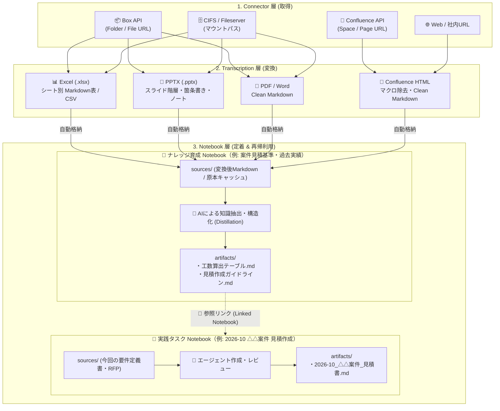
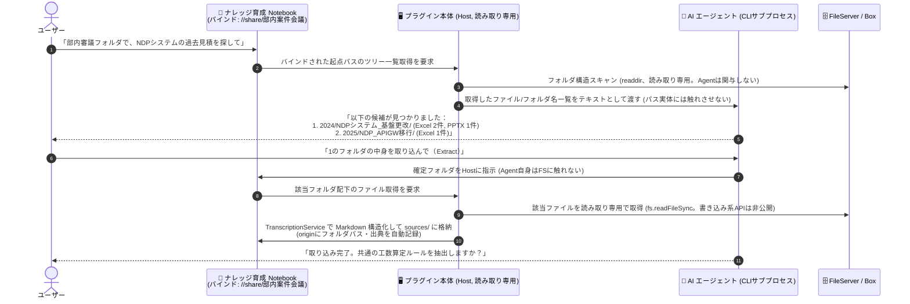

# Design Document: Obsidian AI Notebook Plugin
## ナレッジ再帰育成型アーキテクチャ (Recursive Knowledge Ecosystem)

## 1. 概要 (Overview)
`Obsidian AI Notebook` は、Google NotebookLM の直感的なコンテキスト駆動型ワークスペース体験と、Antigravity 2.0 / Claude Code のプロジェクトフォルダ型ファイル育成モデルを融合させた Obsidian プラグインです。
ユーザーは「ノートブック」という単位で特定のテーマ・プロジェクトに関するインプット（直ファイル・参照ノート）を集約し、ローカルAIエージェント（Antigravity CLI / Claude Code CLI）と対話しながら、成果物を生成・管理します。
さらに、生成された成果物は他の新しいタスクのコンテキスト（仕様・ルール・few-shot サンプル）としてシームレスに再利用・育成されます。

詳細な思想的背景については [concept.md](concept.md) を参照してください。

---

## 2. コア概念 & データ構造 (Core Architecture & Data Structure)

### 2.1 データフォルダ構造
全ノートブックデータは Obsidian Vault 内の専用ルートフォルダ（デフォルト: `_ainotebook/`）配下で一元管理されます。

```
<Vault_Root>/
└── _ainotebook/
    ├── index/
    │   ├── 20260831_sys_apigw.md       # APIGW 仕様ノートのメタデータ
    │   ├── 20260831_tpl_release.md     # リリース計画書仕様ノートのメタデータ
    │   └── 20260831_task_rel09.md      # 9月度リリース計画書タスクのメタデータ
    └── notebooks/
        ├── 20260831_sys_apigw/         # システム知識・クセ育成ノート
        │   ├── sources/                # 投入された元資料・設定メモ等
        │   ├── artifacts/              # 成果物: アーキ概要.md, 運用注意点.md
        │   ├── sessions/               # チャットセッション群
        │   │   └── session_01.json
        │   └── chat.json               # （旧形式互換）
        ├── 20260831_tpl_release/       # ドキュメント仕様・ルール育成ノート
        │   ├── sources/
        │   ├── artifacts/              # 成果物: 作成ルール.md, few-shotサンプル.md
        │   ├── sessions/
        │   └── chat.json
        └── 20260831_task_rel09/        # 実践タスクノート
            ├── sources/                # 今回固有のファイル (PR差分、会議メモ)
            ├── artifacts/              # 今回生成された成果物 (2026-09リリース計画書.md)
            ├── sessions/
            │   ├── session_draft.json  # ドラフト作成セッション
            │   └── session_review.json # レビュー・修正セッション
            └── chat.json
```

### 2.2 ID 命名規則 & Metadate Index
- **ID 形式**: 衝突防止のため `YYYYMMDD_random6char`（例: `20260831_a8f9x`）
- **Index ノート (`_ainotebook/index/<ID>.md`)**:
  ```markdown
  ---
  notebook_id: "20260831_task_rel09"
  title: "2026-09 APIGW リリース計画書作成"
  created_at: "2026-08-31T17:00:00+09:00"
  updated_at: "2026-08-31T17:00:00+09:00"
  tags: [release, apigw, task]
  icon: "rocket"
  description: "2026年9月度 APIGW 本番リリース計画書の作成タスク"
  linked_notebook_ids:
    - "20260831_sys_apigw"
    - "20260831_tpl_release"
  active_session_id: "session_20260831_draft"
  ---
  # 2026-09 APIGW リリース計画書作成

  ここにノートブック全体の自由メモやタスク概要を記載可能。
  ```

---

## 3. 画面構成 & UI/UX (UI Layout & Interaction)

プラグインは Obsidian のメインワークスペース（Main Panel / Center Leaf）で大画面表示されます。

### 3.1 ギャラリービュー (`AINotebookGalleryView`)
- **ヘッダー**: タイトル、検索・フィルターバー、新規ノートブック作成ボタン
- **ギャラリーエリア**: カードグリッド表示
  - 各カード: タイトル、説明、最終更新日、ソース件数、リンク件数、成果物件数、カバー/アイコン
  - カードクリック: 対象ノートブックの詳細ビューを開く

### 3.2 ノートブック詳細ビュー (`AINotebookDetailView`)
3カラムレスポンシブレイアウト。

```
+-----------------------------------------------------------------------------------+
|  < ギャラリーへ戻る   |  2026-09 APIGW リリース計画書作成            [Antigravity CLI] |
+-------------------+-----------------------------------+---------------------------+
| [コンテキストパネル]| [💬 AI チャット] [💬ドラフト ▼][+新規]| [成果物パネル]            |
|                   |                                   |                           |
| 🔗 参照ノートブック    | User: 今回のPR差分から計画書を    | - 新規メモ作成ボタン      |
|  ├ 📘 APIGW 仕様  |       作って。                    | 📄 2026-09_APIGW_計画書.md|
|  └ 📋 リリース仕様| AI  : APIGWのクセとサンプルの     |                           |
|   [+ 参照ノート追加]|       章立てを踏まえて作成しました|                           |
|                   |       ```markdown:...             |                           |
| 📂 直接ファイル   |                                   |                           |
|  ├ pr_diff.patch  |                                   |                           |
|  └ memo.txt       | [ メッセージを入力...     (送信) ]| (クリックでポップアップ表示)|
|   [+ ファイル追加]|                                   |                           |
+-------------------+-----------------------------------+---------------------------+
```

1. **左カラム (Context & Source Panel)**:
   - **参照ノートブックセクション (Linked Notebooks)**: 既存の他ノートブックを複数選択してリンク。リンク解除や対象ノートブックへの即時ジャンプが可能。
   - **直接ファイルセクション (Direct Files)**: D&Dおよびファイル選択による固有ファイルの投入。
2. **中央カラム (Chat Panel)**:
   - **マルチチャットセッション対応**: 過去セッションの選択・切り替え、新規セッションの作成（+）、リネーム・削除。
   - スレッド表示形式のメッセージUI（MarkdownRenderer + コピー機能）。
   - 直接投入されたファイル群に加え、**リンクされた全ノートブックの成果物（`artifacts/`）** および直近の会話履歴をプロンプトに統合展開。
3. **右カラム (Artifact Panel)**:
   - `artifacts/` フォルダ内の成果物をカード表示。
   - カードクリックでポップアップモーダルを開き、Markdownプレビュー & 編集が可能。

---

## 4. AI エージェント抽象化構造 (Agent Adapter Architecture)

Antigravity CLI / Claude Code CLI 等の各種自律エージェントCLIツールと連携。
ノートブックルートを作業ディレクトリ（`cwd`）としてエージェントに渡し、`artifacts/` 配下の成果物を直接作成・部分編集（Write/Edit）させます。

```typescript
export interface LinkedContext {
    notebookId: string;
    notebookTitle: string;
    description: string;
    artifacts: { name: string; title: string; path: string; content: string }[];
}

export interface AgentOptions {
    notebookDir: string;       // 当該ノートブックルートの絶対パス (CLI cwd)
    sourcesDir: string;        // 当該ノートブック sources/ フォルダの絶対パス
    artifactsDir: string;      // 当該ノートブック artifacts/ フォルダの絶対パス
    commandPath: string;       // agy / claude の実行パス
    maxTurns?: number;         // ターン上限（暴走防止）
    linkedContexts?: LinkedContext[];
    chatHistory?: ChatMessage[]; // 直近の対話履歴（マルチターン文脈）
    onStdoutChunk?: (chunk: string) => void; // ストリーミングコールバック
    abortSignal?: AbortSignal;               // キャンセル用シグナル
}

export interface AgentResult {
    text: string;
    artifactsCreated?: string[];
    artifactsModified?: string[];
}

export interface AIAgentAdapter {
    id: string;
    name: string;
    executePrompt(prompt: string, options: AgentOptions): Promise<AgentResult>;
}
```

---

---

## 5. 外部ソース連携 & 決定的変換アーキテクチャ (External Source Ingestion & Transcription)

企業内に分散する既存資産（Box / Confluence / CIFSファイルサーバー上の Excel, PPTX, Word, Confluenceページ等）をシームレスに取り込み、Notebook のナレッジとして定着・再利用するためのアーキテクチャです。



### 5.1 3層構造の役割分担
1. **Connector 層 (取得)**:
   - Box API、Confluence Cloud REST API v2、CIFS/共有フォルダ、Web からメタデータおよび生バイナリ/HTML を取得。
   - `AIAgentAdapter` と同様に `SourceConnectorAdapter` としてプラグイン抽象化。
2. **Transcription 層 (変換)**:
   - **決定的変換 (Deterministic Parsing)**:
     - AI を介さず、ライブラリ（SheetJS, python-pptx / node, mammoth, turndown 等）により高速・安定的・機械的に構造化 Markdown へ変換。
   - **意味的な転記・要約 (Semantic Distillation)**:
     - 変換された Markdown を入力とし、既存のエージェント直接編集モデルを通じて `artifacts/` 配下に「単価根拠」「システム仕様」「作成ルール」等の洗練されたドメインナレッジを出力（ユーザーの通常対話で実行）。
3. **Notebook 層 (定着 & 再利用)**:
   - 既存の `sources/`, `artifacts/`, `linked_notebook_ids` の仕組みにそのまま乗せる。

### 5.2 コネクタ抽象化インターフェース
```typescript
export interface SourceItemRef {
    connectorId: 'box' | 'confluence' | 'cifs' | 'web';
    remoteId: string;        // Box file_id / Confluence pageId / CIFS絶対パス
    remoteUrl: string;       // ブラウザで開けるURL（出典表示・ジャンプ用）
    title: string;           // 表示名
    mimeType: string;
    remoteVersion?: string;  // etag / contentVersion / mtime (差分検知用)
}

export interface SourceConnectorAdapter {
    id: string;
    name: string;
    isConfigured(settings: AINotebookSettings, secrets: Record<string, string>): boolean;
    resolveFromUrl(url: string): Promise<SourceItemRef[]>; // URLから対象一覧を解決
    download(item: SourceItemRef): Promise<{ buffer: ArrayBuffer; filename: string }>;
}
```

### 5.3 データモデル拡張 (`NotebookSource` と `SourceOrigin`)
```typescript
export interface SourceOrigin {
    connectorId: 'box' | 'confluence' | 'cifs' | 'web';
    remoteUrl: string;
    remoteId: string;
    remoteVersion?: string;
    lastSyncedAt: string;
}

export interface NotebookSource {
    name: string;
    path: string;
    extension: string;
    size: number;
    addedAt: string;
    origin?: SourceOrigin;   // 外部連携経由の場合に付与
}
```

### 5.4 セキュリティ設計 (API Secrets の安全な分離管理)
- Obsidian の設定ファイル（`data.json`）は Vault 内に平文保存されるため、Git 共有や外部同期時に API トークンが漏洩するリスクがある。
- Box Developer Token / OAuth Token、Confluence API Token 等のシークレットは、`.gitignore` 対象の専用ファイル（例: `_ainotebook/.secrets.json`）に分離保存し、リポジトリにコミットされない構造とする。

### 5.5 スナップショット同期と再同期・差分検知
- 内部リンク（`linked_notebook_ids`）は動的参照であるが、外部ソースは取り込み時点の **スナップショット** として `sources/` に保持する。
### 5.6 実務を精巧に再現する模擬テストデータ生成作戦 (Mock Enterprise Fixtures)
個人の開発環境（自宅Mac等）には会社実物の機密Excel/PPTXが存在しないため、**「実務のリアルなクセ・構成・ノイズ」を再現した模擬テストデータ生成スクリプト** を用意し、ローカル環境で「いける感」を100%体感・検証できるようにする。

- **再現するリアルな実務データ例 (`tests/fixtures/sample_estimates/`)**:
  1. `01_2024_A社_基幹システム刷新_工数見積書_v2.0.xlsx`:
     - 複数シート（「表紙」「工数内訳・計算根拠」「単価マスター」「更新履歴」）
     - セル結合（カテゴリ見出し）、数式（`=SUM()`, `=単価*人月`）、注記（「※夜間作業は割増」等）
  2. `02_2025_B社_APIGW移行_概算見積シート_fix.xlsx`:
     - 別フォーマットの工数積算表、インフラ/アプリ/運用の役割別工数
  3. `03_2025_C社_クラウド移行_費用算出.xlsx`:
     - リスクバッファ係数や値引きロジックが含まれるシート
  4. `04_提案書_システム方式設計_抜粋.pptx`:
     - スライド箇条書き ＋ スライドノート（口頭説明用メモ・重要暗黙知）
  5. `05_要件定義書_非機能要件_サンプル.docx`:
     - H1/H2/H3 見出し階層 ＋ SLA/可用性テーブル
- **エンドツーエンドの検証シナリオ**:
  1. 上記模擬ファイルを Phase 4b の決定的変換に通し、クリーンな構造化 Markdown として `sources/` に取り込まれるか確認。
  2. 「📘 案件見積基準・過去実績ナレッジ」Notebook で AI と対話し、`artifacts/工数算出テーブル.md` や `artifacts/見積作成ガイドライン.md` が自律的に育つかを検証。
  3. 新タスク「🚀 2026-10 D社 見積作成」で上記 Notebook をリンクし、新規見積書ドラフトが高精度に生成される「ナレッジ再帰育成サイクル」を自宅Mac上で完全検証。

### 5.7 Notebook単位の外部フォルダバインド ＆ AI探索・一括Extractモデル (Folder Binding & AI Discovery Extract)
企業のファイルサーバー（CIFS）や Box 上の実務資産は、「`部内案件会議/`」などの親フォルダ配下に年度別（`2024/`）やテーマ・案件別フォルダが無秩序・階層的に散らばっているケースが大多数です。手作業でのD&Dを強いるのではなく、**「Notebookに外部フォルダをバインドし、AIにツリーを探索させて指定フォルダを一括Extractする」** 運用モデルを提供します。



> ⚠️ **重要 (2026-08-31 追記)**: `ClaudeCodeAdapter` / `AntigravityCliAdapter` はいずれも `--dangerously-skip-permissions` でCLIを起動しており、`cwd` はプロンプト上の体裁であって、そのプロセスの読み書き先をディレクトリ外に出さないよう強制するサンドボックスではない。したがって外部フォルダ（実務では編集権限のある本物のCIFS共有）へのファイルシステム操作（探索・読み取り）は、**AIエージェント（CLIサブプロセス）に一切行わせず、必ずプラグイン本体（Host）側の読み取り専用コードで行う。** Agentに渡すのはHostが取得した名前一覧・テキストのみとし、実パスへの操作手段そのものを与えない。この制約はPhase 4cの実装開始時点から適用し、後から足す対策にはしない。

- **メタデータ拡張 (`index/<id>.md`)**:
  ```yaml
  bound_folder_path: "/Volumes/share/部内案件会議" # または Box Folder URL
  ```
- **UI & 出典表示**:
  - 左カラムのソースパネルに、バインドされたフォルダパスが表示される。
  - 「📁 フォルダツリーから選択」モーダルで、GUIからも階層を辿ってフォルダ/ファイルを選択・一括取り込み可能。
  - 取り込まれたソースには「📁 `2024/NDPシステム_基盤更改/`」という親フォルダ別のグループタグ/バッジが付与され、どこから来たファイルかが一目瞭然になる。

---

## 6. 段階的開発計画 (Phased Implementation Plan)

- **Phase 1**: コンセプト・設計仕様・AGENTS.md・タスク管理の整備 (Done)
- **Phase 2**: データモデル拡張 (`linked_notebook_ids` 対応) & ナレッジ再帰育成アーキテクチャ (Done)
- **Phase 3**: エージェント直接編集モデルへの移行 (Done)
  - CLI `cwd` のノートブックルート化と自動編集権限付与 (`--permission-mode acceptEdits` / `--mode accept-edits`)
  - 成果物の段階的作成・部分修正および mtime による編集競合防止ガード
  - レビュー成果物（`review_*.md`）フローと識別表示
  - イベントログ駆動型生成来歴 (Provenance) 記録
  - `spawn` による stdout ストリーミング & 中止（キャンセル）機能
- **Phase 4**: 外部ソース連携 & 決定的変換パイプライン (In Progress)
  - **Phase 4a: CIFS / 共有フォルダ対応**: マウントパス指定によるファイル選択ダイアログ起点設定、複数ファイル一括インポート (Done。ただし実態は `prompt()` によるファイル名手入力の暫定実装。詳細はTASK-025参照)
  - **Phase 4b: 決定的変換 (Transcription) パイプライン & 模擬テストデータ生成**:
    - 実務再現テストデータ生成スクリプト（複数シートExcel、セル結合、数式、スライドノート付きPPTX、見出し付きWord） (Done)
    - `.xlsx`（シート別表Markdown化）、`.pptx`（スライド別テキスト/ノート抽出）、`.docx` の Markdown 構造化 (Done)
  - **Phase 4c: Notebook単位のフォルダバインディング & AI探索・一括Extract（開発・検証はモックfixture/ローカルコピーのみで行い、本物のCIFS共有には接続しない）** (Next)
    - `bound_folder_path` メタデータ対応
    - フォルダ探索・ファイル読み込みは常にHost（プラグイン本体）側の読み取り専用コードが行い、AIエージェント（CLIサブプロセス）には実パスを一切渡さない設計を前提とする（上記シーケンス図・注記を参照）
    - AIによる階層フォルダ探索・候補提示（ファイルサーバー/Boxツリー走査。探索結果はHostが取得したテキスト一覧をAgentに渡すのみ）
    - 指定フォルダ配下の一括Markdown変換・`sources/` 格納・出典フォルダバッジ表示
  - **Phase 4d: 外部フォルダの読み取り専用防御の本実装（本物のCIFS接続を解禁するゲート）** (Next after 4c)
    - `BoundFolderReader.ts`: 読み取り専用API（`listTree()` / `readFile()`のみexport）への切り出しと、書き込み系APIが存在しないことを保証する自動テスト
    - OS/マウントレベルでの読み取り専用マウント等、多層防御の検討
    - 読み込みの監査ログ（`origin.lastSyncedAt` 等の活用）
    - 上記が揃うまでは `boundFolderPath` に実際の編集権限付き共有フォルダを設定しない、という運用ルールの明文化
  - **Phase 4e: Box Connector**: Box API 連携、フォルダ/ファイル URL 解析、一覧取得・ダウンロード
  - **Phase 4f: Confluence Connector**: Confluence Cloud REST API v2 連携、ページ/スペース URL 解析、Clean Markdown 変換
  - **Phase 4g: ソースパネル UI 拡張 & 再同期・差分検知**: 左カラム「📥 外部ソース」セクション、最終同期日時表示、差分検知・再同期アクション
- **Phase 5**: チーム展開・高度な目録管理 & コンテキスト検索 (Future Scope)
  - 知識 Notebook 肥大化時の関連 artifact 抽出・埋め込み検索 (Embedding Search)


